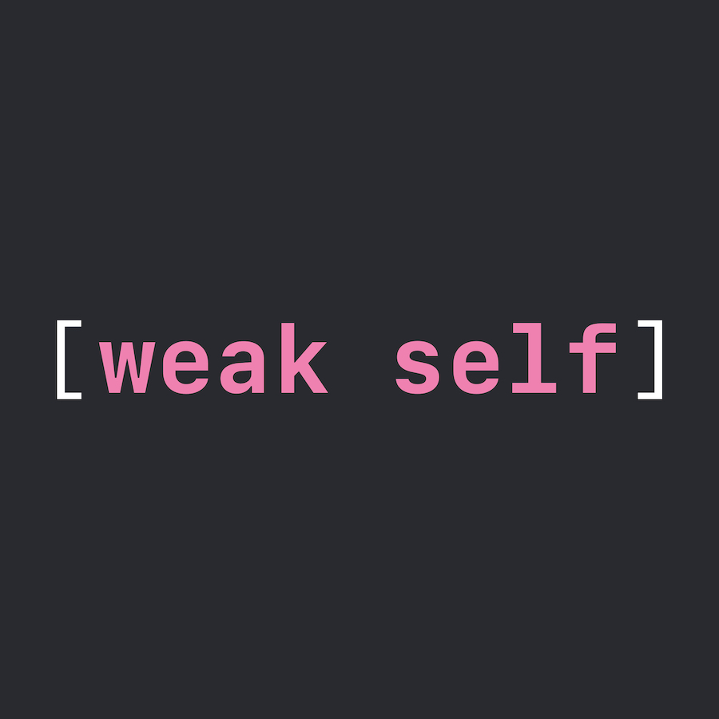
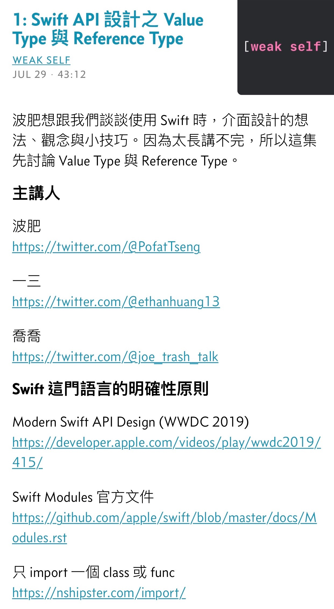
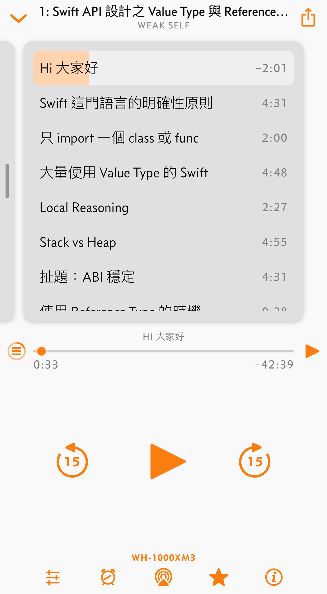

# weak self podcast

集結弱弱的我，也可以組成強大的社群。三個在 iOS 開發圈打滾的台灣工程師，專為 Apple & iOS 開發者而製作的 Podcast。主持人<a href="https://twitter.com/@ethanhuang13">一三</a>、<a href="https://twitter.com/@PofatTseng">波肥</a>、<a href="https://twitter.com/@joe_trash_talk">喬喬</a>。內容涵蓋了 iOS 與 Apple 開發圈的新知討論、踩坑經驗、人物採訪、社群活動、職場生活。

[聽眾朋友怎麼說？](/feedbacks)・[weak self 歷史](/history)

## 線上收聽

可使用 <a href="https://overcast.fm/itunes1474108801/weak-self">Overcast</a>、<a href="https://www.listennotes.com/podcasts/weak-self-弱弱的我-一三波肥喬喬-Fx4L9ZKHCTg/">Listen Notes</a> 或 <a href="https://www.google.com/podcasts?feed=aHR0cHM6Ly9hbmNob3IuZm0vcy9jOTE0OTY0L3BvZGNhc3QvcnNz">Google Podcasts</a> 網站。

## 訂閱方式

**weak self** 支援任何 podcast 播放軟體，只要訂閱我們的 [RSS](https://api.soundon.fm/v2/podcasts/233d04e2-60e9-4060-a687-6b7316187f48/feed.xml) 網址即可。

     

## 2 分鐘試聽

<iframe src="https://embed.podcasts.apple.com/us/podcast/%E8%A9%A6%E8%81%BD%E9%9B%86-%E7%AF%80%E7%9B%AE%E7%B0%A1%E4%BB%8B/id1474108801?i=1000453152964&amp;itsct=podcast_box&amp;itscg=30200" height="175px" frameborder="0" sandbox="allow-forms allow-popups allow-same-origin allow-scripts allow-top-navigation-by-user-activation" allow="autoplay *; encrypted-media *;" style="width: 100%; max-width: 660px; overflow: hidden; border-top-left-radius: 10px; border-top-right-radius: 10px; border-bottom-right-radius: 10px; border-bottom-left-radius: 10px; background-color: transparent; background-position: initial initial; background-repeat: initial initial;"></iframe>

## 節目列表

### 第四季

[62: 不想努力了，負債力就是你的超能力](/episodes/62)

[61: 學 SwiftUI 之前先把 UIKit 給忘掉](/episodes/61)

[60: Swift 你給我等一等](/episodes/60)

[59: 貓貓亂入 Swift](/episodes/59)

[58: Apple Silicon－當劃時代創新出現，世界要多久才能理解它？](/episodes/58)

### 第三季

[57: 第四季預告](/episodes/57)

[56: Swift 不可分割](/episodes/56)

[55: 波肥的軟工相談室](/episodes/55)

[54: 真的不是業配，只是要推坑](/episodes/54)

[53: 年度最大傷害](/episodes/53)

[52: 躺在風口上，波肥都能飛](/episodes/52)

[51: 突如其來的獨立開發](/episodes/51)

[50: 拖延症患者為你說說 WWDC 20 的那些冷門 sessions](/episodes/50)

[49: 一三報你災之 App Store 審查傷害](/episodes/49)

[48: 聽到 weak self 又發生錄音事故，那我就放心了](/episodes/48)

[47: 好，錄了！工程師與 PM 圍繞 WWDC20 開展的對話](/episodes/47)

[46: 推你入坑 SwiftUI 不後悔](/episodes/46)

[45: iOS 14 主畫面帶來 App 存在感危機！](/episodes/45)

[44: 隱私流程改到你會怕](/episodes/44)

[43: MetricKit—App 怎麼死的不用通靈啦](/episodes/43)

[42: App Clips—應用程式切片是迷你 App 嗎？](/episodes/42)

[41: Widgets are not mini apps, widgets are not mini apps, widgets are not mini apps](/episodes/41)

[40: Apple Silicon](/episodes/40)

[39: 第三季弱勢回歸！先來聊聊 WWDC20 印象](/episodes/39)

### 第二季

[38: 一直砍扣一直爽](/episodes/38)

[37: 欸，這個壞掉了之 Log 的那些事、IAP 的傷害](/episodes/37)

[36: Strong Wife 跟 WWDC 回顧加預測](/episodes/36)

[35: 勞動節特輯之人生不一定有答案](/episodes/35)

[34: 心動投資法之蘋果的股票可不可以買](/episodes/34)

[33: 喬喬沒賣藥電台：iPhone SE](/episodes/33)

[32: 本集節目要 @audreyt 唐鳳、Pair Programming、Apple 與 Google 合作](/episodes/32)

[31: 真的不是聊動森的 Podcast](/episodes/31)

[30: 開發圈近況與遊戲的隨性聊](/episodes/30)

[29: 來做 Side Project 系列之好用的搜尋功能](/episodes/29)

[28: 來做 Side Project 系列之誰能比我鍵](/episodes/28)

[27: 來做 Side Project 系列之不要剛見面就要個資啊](/episodes/27)

[26: iOS 開發生平大坑之 DateFormatter](/episodes/26)

[25: 難道公司發大財了！？App Launch Time 加速面面觀](/episodes/25)

[24: 你也是薪水小倫嗎？上班族如何利用上班時間精進程式功力](/episodes/24)

[23: 在家工作！WFH 時怎麼樣才不會 WTF](/episodes/23)

[22: 喬喬賣藥電台：上班族業績與工程師技術債+如何跟強者同事相處+玻璃心同事](/episodes/22)

### 第一季

[21: @escaping vs @nonescaping](/episodes/21)

[20: 幕後花絮之 1/11 回家投票](/episodes/20)

[19: 年度最佳 bug](/episodes/19)

[18: 綠背影的聽力測驗之怎麼害人](/episodes/18)

[17: 便宜行事的第二集—我就是那個奇葩同事](/episodes/17)

[16: 資深工程師什麼時候才學 SwiftUI 跟 Design Patterns](/episodes/16)

[15: Code Review 趴吐](/episodes/15)

[14: 資深被資遣工程師](/episodes/14)

[13: 喬喬 Erasure](/episodes/13)

[12: 販售焦慮，Mobile 工程師能不學 Flutter 嗎？](/episodes/12)

[11: 先 build 得起來再說—Project Catalyst 踩坑記錄](/episodes/11)

[10: 喬喬 escaping](/episodes/10)

[9: 帶你親臨 iPlayground 現場](/episodes/9)

[8: 平行宇宙工程師](/episodes/8)

[7: 這集叫罐頭🥫](/episodes/7)

[6: 真・三人・weak self](/episodes/6)

[5: 這裡沒有心靈雞湯配大餅](/episodes/5)

[4: 或許我可以把 title 改成資深文件工程師](/episodes/4)

[3: 就是要豪華便當！詹里長 hokila 的技術研討會全攻略](/episodes/3)

[2: Swift API 設計之原來我不會用 protocol](/episodes/2)

[1: Swift API 設計之 Value Type 與 Reference Type](/episodes/1)

[0: 如果你想要浪費一個人的暑假](/episodes/0)

## 主持人

**一三** / 13
[@ethanhuang13](https://twitter.com/@ethanhuang13)

**波肥** / Pofat
[@PofatTseng](https://twitter.com/@PofatTseng)

**喬喬** / Joe
[@joe_trash_talk](https://twitter.com/@joe_trash_talk)

## 常見問題
Q: 這個 podcast 是關於什麼？  
A: 三個在 iOS 開發圈打滾一段時間的台灣軟體工程師，想到一些 Apple/iOS 開發相關題目來聊聊。偶爾會有特別來賓訪談。

Q: 你們的更新時間與頻率？  
A: 我們不定期會更新，最短是一週一次。如果該週有節目的話，通常會在週一凌晨上線。所以你的 Blue Monday 有我們的陪伴。

Q: 為什麼叫作 **weak self**？  
A: `[weak self]` 是 Swift 程式語言裡處理記憶體的語法，我們在[第 10 集](/episodes/10)有詳細討論。不過當初取這個名字主要是想表達「我們這麼弱也可以來錄 podcast，真好玩」。後來逐漸演變成🐓雞湯式標語🍲 **weak self, strong community**，意思是「集結弱弱的我，也可以組成強大的社群」。

Q: 什麼是收聽 **weak self** 最棒的方式？  
A: 由於功能的關係，我們推薦使用 iOS 的 [Overcast](https://overcast.fm/itunes1474108801/weak-self) app 聆聽，但你也可以用任何 podcast app。最重要的是，**請 follow 我們的 [Twitter](https://twitter.com/weak_self)**，才不會錯過任何最新消息🥰

Q: 我想要聽 OO 題目 / 我想要回饋或提供意見...  
A: 請到我們的 [Twitter](https://twitter.com/weak_self) 回覆與 DM，或在[提問箱](https://peing.net/zh-TW/weak_self)匿名發問。

Q: 你們開放贊助或工商服務嗎？  
A: 先說聲謝謝🙏，請參考下方說明。

## 贊助

關於贊助這件事情我們討論好一陣子。雖然有數家國內外廠商與我們聯絡，最後得出的結論是，讓大家都開心比較重要。

所以 **weak self 目前只接受個人名義的贊助**，不會有廠商贊助而置入廣告。這樣我們在製作上也比較簡單。

**您的贊助是為了鼓勵創作或補貼製作開銷，不會影響到我們節目未來的內容與走向（donation, not sponsorship）。**

我們的贊助後台是採用綠界科技的實況主收款，收款人黃逸杉（13），e-mail 為 blesserx[at]gmail.com。

贊助請到[這邊](http://bit.ly/36P0HnE)（可用台灣信用卡或 ATM 轉帳）。你可以選擇填寫地址來接收實體收據，或者在留言區塊留下 email。

 

### 贊助者

我們把[名單](https://mobile.twitter.com/weak_self/lists/donors/members)公開在 Twitter 上。非常感謝所有支持 **weak self** 的聽眾朋友們🙏

<blockquote class="twitter-tweet" data-lang="zh-tw" data-theme="dark" data-link-color="#FC5FA3">
感謝乾爹 <a href="https://twitter.com/rollr76518?ref_src=twsrc%5Etfw">@rollr76518</a> 捐贈 Blue Yeti 乙支🙏🙏🙏 <a href="https://t.co/ra6SZmXdfl">pic.twitter.com/ra6SZmXdfl</a>
&mdash; weak self podcast 「我很弱，不要把我算進去」 (@weak_self) <a href="https://twitter.com/weak_self/status/1174539959207780353?ref_src=twsrc%5Etfw">2019年9月19日</a></blockquote> 

## 筆記與章節功能

**weak self** 每一集都會包含節目內容的筆記與章節，方便你查看相關連結，以及跳轉到特定位置。下圖以 Overcast 為例：

### 筆記（Show Note）

### 章節（Chapter Marker）

## 後台系統
我們使用 [SoundOn](https://host.soundon.fm) 上架。

## 副產品
因為要整理 podcast 的話題，蒐集了不少材料。沒有機會錄製的部分就放在[«13的開發者週報»](https://ethanhuang13.substack.com)，歡迎訂閱。
