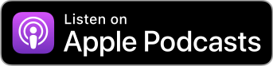
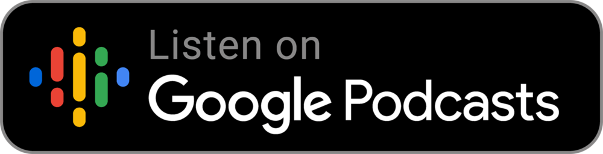

# weak self podcast

三個在 iOS 開發圈打滾的台灣工程師，專為 Apple/iOS 開發者而製作的 Podcast。主講人[一三](https://twitter.com/@ethanhuang13)、[波肥](https://twitter.com/@PofatTseng)、[喬喬](https://twitter.com/@joe_trash_talk)。

中文名稱有多個版本任君挑選：《不要算我》、《弱弱的我》、《等等就找不到我》🤪

## 線上收聽

請使用 <a href="https://overcast.fm/itunes1474108801/weak-self">Overcast</a>。

## 訂閱方式
 

 

 

## 主講人

**一三** / 13
[@ethanhuang13](https://twitter.com/@ethanhuang13)

**波肥** / Pofat
[@PofatTseng](https://twitter.com/@PofatTseng)

**喬喬** / Joe
[@joe_trash_talk](https://twitter.com/@joe_trash_talk)

## 近期節目

[5: 這裡沒有心靈雞湯配大餅](/episodes/5)

[4: 或許我可以把 title 改成資深文件工程師](/episodes/4)

[3: 就是要豪華便當！詹里長 hokila 的技術研討會全攻略](/episodes/3)

[2: Swift API 設計之原來我不會用 protocol](/episodes/2)

[1: Swift API 設計之 Value Type 與 Reference Type](/episodes/1)

[0: 如果你想要浪費一個人的暑假](/episodes/0)

## 常見問題
Q: 這個 podcast 是關於什麼？  
A: 三個在 iOS 開發圈打滾一段時間的人，想到一些 Apple/iOS 開發相關題目來聊聊。偶爾會有特別來賓訪談。

Q: 你們的更新時間與頻率？  
A: 我們不定期會更新，最短是一週一次。如果該週有節目的話，會在週一凌晨上線。所以你的 Blue Monday 有我們的陪伴。

Q: 為什麼叫作 **weak self**？  
A: 有機會的話，會在未來的節目會說明😛

Q: 什麼是收聽 **weak self** 最棒的方式？  
A: 由於功能的關係，我們推薦使用 iOS 的 [Overcast](https://overcast.fm/itunes1474108801/weak-self) app 聆聽，但你也可以用任何 podcast app。最重要的是，**請 follow 我們的 [Twitter](https://twitter.com/weak_self)**，才不會錯過任何最新消息🥰

Q: 你們開放贊助或工商服務嗎？  
A: 先說聲謝謝🙏。我們現在比較需要的是錄音設備（麥克風）。至於工商的話，現在才剛開始，等我們上軌道以後可以考慮。

Q: 我想要聽 OO 題目 / 我想要回饋或提供意見...  
A: 請到我們的 [Twitter](https://twitter.com/weak_self) 回覆與 DM，或在[提問箱](https://peing.net/zh-TW/weak_self)匿名發問。

<!--
## 如何訂閱？
下面是各大常用的 podcast apps。你可以點擊連結或是直接搜尋 weak self。

### Apple Podcasts / iTunes
https://podcasts.apple.com/tw/podcast/weak-self/id1474108801
> 支援筆記、章節、調整速度

### Overcast（推薦）
https://overcast.fm/itunes1474108801/weak-self
> 支援筆記、章節、調整速度、智慧加速、聲音強化

### Spotify
https://open.spotify.com/show/4qAJjdyhx5AgHHL4VuTauj
> 支援調整速度

### Anchor
https://anchor.fm/weakself
> 支援筆記（僅純文字）、調整速度（三種速度）

### Pocket Casts
https://pca.st/9Z02
> 支援筆記、章節、調整速度、智慧加速、聲音強化

### RSS Feed
https://anchor.fm/s/c914964/podcast/rss
透過這個 feed，你可以用任何 podcast app 訂閱 weak self。直接點連結可能不會是你想要的結果😂，最好複製網址再貼過去。

### 其他 Podcast Apps
* [Breaker](https://www.breaker.audio/weak-self)
* [Google Podcasts](https://www.google.com/podcasts?feed=aHR0cHM6Ly9hbmNob3IuZm0vcy9jOTE0OTY0L3BvZGNhc3QvcnNz)
* [RadioPublic](https://radiopublic.com/weak-self-WxO4K1)
* [Stitcher](https://www.stitcher.com/podcast/anchor-podcasts/weak-self)
-->

---
## 筆記與章節功能

**weak self** 每一集都會包含節目內容的筆記與章節，方便你查看相關連結，以及跳轉到特定位置。下圖以 Overcast 為例：

### 筆記（Show Note）

### 章節（Chapter Marker）

## 後台系統
我們使用 [Anchor](https://anchor.fm/weakself) 上架。

## 副產品
因為要整理 podcast 的話題，蒐集了不少材料。沒有機會錄製的部分就放在[«13的開發者週報»](https://ethanhuang13.substack.com)，歡迎訂閱。
